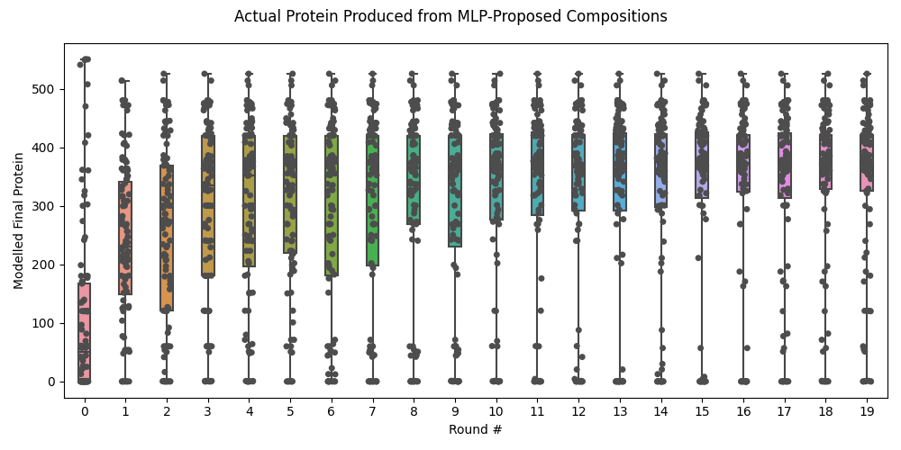
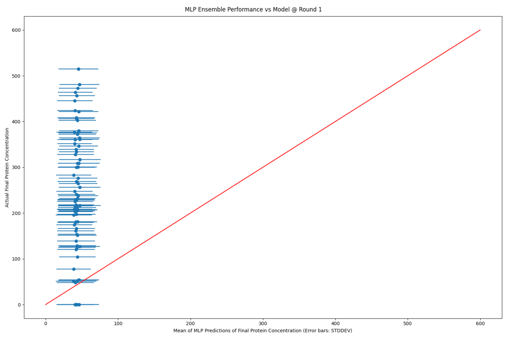

# Project notes


* Could try total exploitation. or exploration to begin with followed by a pivot to exploitation.
* DoE on initial exploration phase?

* Optimise reaction velocity as well using a value which is a combination of maximum slope and timepoint. 
* Need to look at initial sample. latin hypercube in combination with a little more rational choices

* need to look at initial sampling strategy. - Draw cube and sample uniformly. - Latin Hypercube?

* Implement model performance metrics - each model mae or better over time as subplots - barplots or better?

* Implement callbacks, checkpoints and writing the model to disk

# Intro

 This is an active learning implementation for optimising CFPS based on Borkowski 2020.

 An ensemble of 25 MLPs, the weights of each are initialised with a unique pseudo-random seed, are trained on **in silico** data from the course-grained Mavelli model of transcription and translation.

 The trained MLPs then predict the yield of a large number of initial reaction compositions. The best performing compositions are then modelled to produce the **actual** yields.  

 The new data is then concatenated to the master dataset and the MLPs are retrained.

 
### Actual Protein Yields at each round: latest



### Predicted vs Actual Protein Yields over rounds



# Docker for Python and Jupyter with GPU-leverage

# Prerequisites

To be honest it took me ages to set this up so not entirely sure. However the Nvidia driver, the Nvidia toolbox were installed. I also installed a load of stuff and changed some settings using a Ubuntu instance. I followed this tutorial but also did a load of other stuff in the dark - sorry!

https://www.youtube.com/watch?v=PdxXlZJiuxA

Dockerfile adapted from Tensorflow

# Usage

```bash
git clone https://https://github.com/aperkins19/AP_AL_TXTL.git
```

## Define Python Packages in requirements.txt

## Build Image

```bash
docker build -t al_txtl_python_gpu .
```


## Run Container

#### Windows:
#### GPU
```bash
docker run -p 8883:8888 --gpus all  -v "%CD%":/app --name al_txtl_python_gpu al_txtl_python_gpu
```
#### No GPU
```bash
docker run -p 8883:8888 -v "%CD%":/app --name al_txtl_python_gpu al_txtl_python_gpu
```
#### Linux:
#### No GPU

```bash
docker run -p 8883:8888 -v $(pwd):/app --name al_txtl_python_gpu al_txtl_python_gpu
```

## Enter the container

You may have to open a new terminal window due to the Jupyter output but you can run the exec command below without navigating to the correct directory.

```bash
docker exec -it al_txtl_python_gpu /bin/bash
```


## Run the script

```bash
python run_multiple.py
```